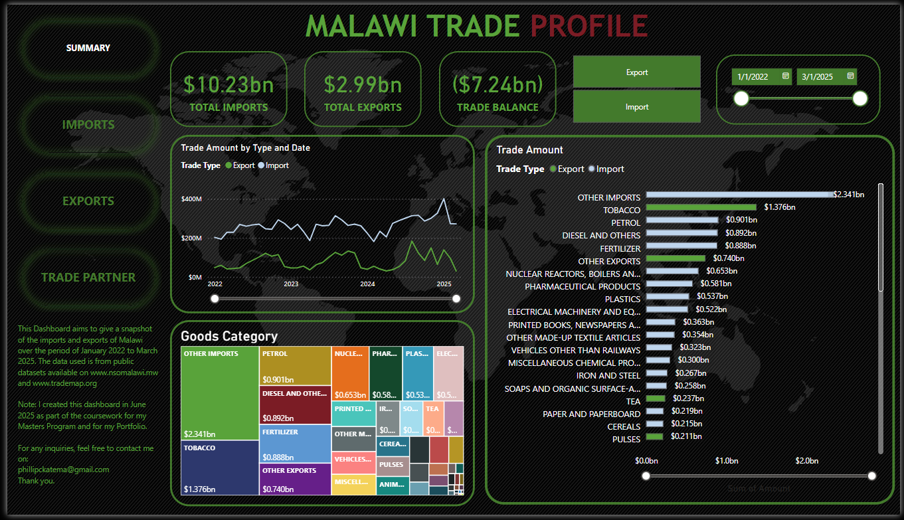
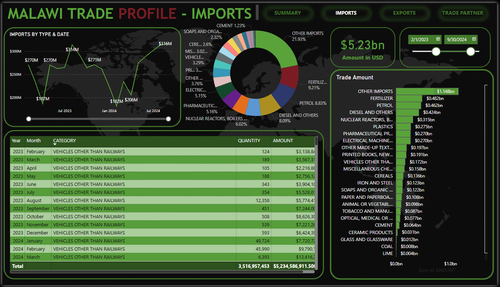
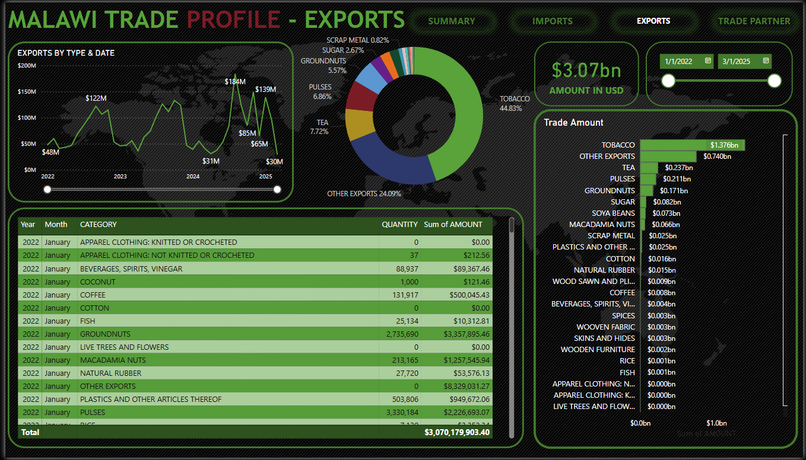
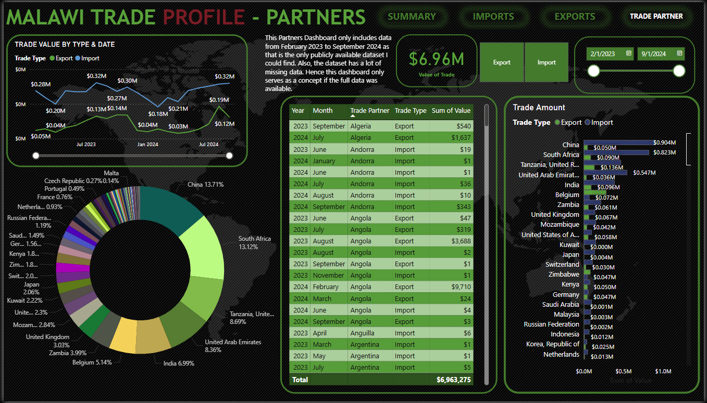

# Malawi_Trade_Profile
PowerBi Analytics Portfolio  
This project was part of my Masters Program and Portfolio where I build a PowerBi Dashboard to show Malawi's Trade Profile. This project was inspired as I was interested in our trade data after having a conversation with a friend and found that we do not have any readily available source of dashboard displaying this information. The Malawi Trade Profile help solves that huddle as it allows you to easily see and understand Malawi's trade information.  
  
Here are all the pages of this dynamic report  
  

  

  

